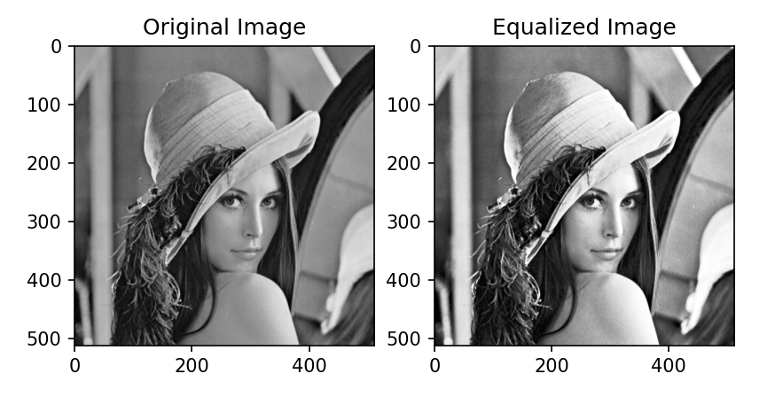
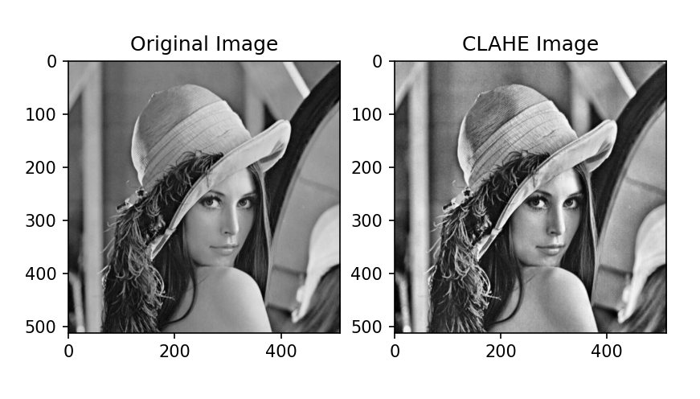
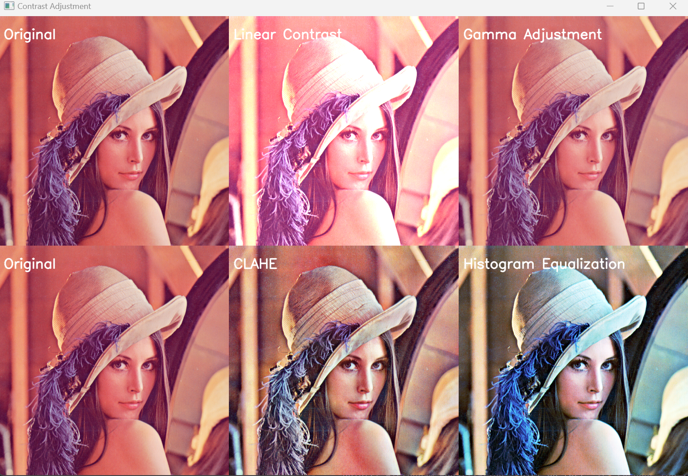

== 3.0 - Video Mathematics

As we have seen in previous chapters, we can use NumPy to create bars, noise, or a gradient. The next step is to create signal generators that are useful, first of all, because they allow us to test the mixer without having an acquisition card or a USB camera available.

What we need to do now is create a base class to use for various inputs. Our ideal base class must have functions to obtain the captured frame, a function to capture the frame, and a function to update the framerate.

[source,python]
----
import time
import cv2
import numpy as np
from PyQt6.QtCore import *
from PyQt6.QtWidgets import *
from PyQt6.QtGui import *

class BaseClass(QObject):
   def __init__(self, synchObject, resolution=QSize(1920, 1080)):
       """
       Initialize the base class with a synchronization object
       and a resolution.
       Connect the synchronization signal to the capture_frame function.
       """
       super().__init__()
       self.synch_Object = synchObject
       self.resolution = resolution
       self._frame = np.zeros((resolution.height(), resolution.width(), 3),
                                                                dtype=np.uint8)
       self.synch_Object.synch_SIGNAL.connect(self.captureFrame)
       self.start_time = time.time()
       self.frame_count = 0
       self.total_time = 0
       self.fps = 0
       self.last_update_time = time.time()

   def __del__(self):
       """
       Release resources and stop the frame processor.
       """
       # Force garbage collection
       pass

   def captureFrame(self):
       """
       Capture a frame, update the FPS, and create a black image with the specified resolution.
       """
       self.updateFps()
       if self._frame is None:
           image = np.zeros((self.resolution.height(),
                   self.resolution.width(), 3), dtype=np.uint8)
           self._frame = np.ascontiguousarray(image)

   def getFrame(self):
       """
       Returns the current image.
       """
       return self._frame

   def updateFps(self):
       """
       Update the FPS (frames per second) value.
       """
       self.frame_count += 1
       current_time = time.time()
       elapsed_time = current_time - self.last_update_time
       if elapsed_time >= 1.0:  # Update FPS every second
           self.fps = self.frame_count / elapsed_time
           self.frame_count = 0
           self.last_update_time = current_time
----

Calculating the frame rate (FPS, frames per second) is essential to ensure that video operations are performed smoothly and consistently. In the context of video applications, the frame rate represents the number of images (frames) displayed per second. To maintain a stable frame rate, it is necessary to constantly monitor and update the time spent processing and displaying each frame.

In the provided code, we use several variables and functions to monitor the frame rate and ensure that frame processing occurs within the desired time frame. Here is a detailed explanation of how the frame rate calculation works:

```
self.start_time = time.time() # Store the start time
self.frame_count = 0 # Count the number of frames processed
self.total_time = 0 # Total elapsed time
self.fps = 0 # Current frames per second
self.last_update_time = time.time() # Last update time
```


Each time the frame rate is updated, the `updateFps` function performs a series of operations. First, it increments the frame counter by one, tracking the number of frames processed since the last FPS update. Then, it gets the current time and calculates the elapsed time since the last FPS update by subtracting the last update time from the current time. If at least one second has passed since the last update, the function calculates the frame rate by dividing the number of frames processed by the elapsed time, thereby providing the number of frames per second. Once the frame rate is calculated, the frame counter is reset to zero to start a new count for the next second, and the last update time is updated with the current time, preparing for the next update cycle.

Another thing to note is that if there is an acquisition problem, it returns a black frame of the specified resolution and does so only if `_frame` is null. This allows us to reduce the workload on inputs like still images, color generators, and bar generators because the `_frame` is set once and, since it is not null, it is not updated anymore.

Let's try to create a color generator as an example.

[source,python]
----
class ColorGenerator(BaseClass):
   _color = QColor(250, 0, 0)  # Initial color: red

   def __init__(self, synchObject, resolution=QSize(1920, 1080)):
       super().__init__(synchObject, resolution)
       self.setColor(self._color)  # Initialize the image with the specified color

   def setColor(self, color: QColor):
       """
       Sets the color of the generated image.
       """
       self._color = color
       self._frame[:, :] = [color.blue(), color.green(), color.red()]

   def captureFrame(self):
       """
       Overrides the captureFrame function of the base class, retaining the original functionality.
       """
       super().captureFrame()

   def getFrame(self):
       """
       Overrides the getFrame function of the base class, retaining the original functionality.
       """
       return super().getFrame()

----

As you can see, by inheriting most of the code from the base class, we don't have to rewrite it, and all the classes we create use the same mechanisms.

In PyQt, the easiest way to display an image is in a QLabel. Qt for images uses two classes, QImage and QPixmap, which unfortunately have their own cost in the program's economy, but they give us the possibility, as we will see, to make the scene navigable, i.e., to be able to pan and zoom and much more.

The first thing we do is bind the **`synch`** object to a function that calls **`getFrame`** from the input, transforms it into a Qt object, and displays it. OpenCV, which we will use for video capturing, uses a BGR color system rather than RGB. I noticed using cProfile that there is a cost to changing this system with **`cvtColor`** that impacts the FPS. It is therefore possible to specify the color channel order, and it only works with 8-bit images at the moment, such as **`Format_BGR888`**.

[source,python]
----
python
class VideoApp(QApplication):
   def __init__(self, argv):
       super().__init__(argv)
       self.synchObject = SynchObject(60)  # Set FPS to 60
       self.input1 = ColorGenerator(self.synchObject)
       self.widget = QWidget()
       self.mainLayout = QVBoxLayout()
       self.viewer = QLabel()
       self.fpsLabel = QLabel()
       self.displayLabel = QLabel()
       self.mainLayout.addWidget(self.viewer)
       self.mainLayout.addWidget(self.fpsLabel)
       self.mainLayout.addWidget(self.displayLabel)
       self.widget.setLayout(self.mainLayout)
       self.widget.show()
       self.viewer.setFixedSize(1920, 1080)
       self.uiTimer = QTimer(self)
       self.uiTimer.timeout.connect(self.display_frame)
       self.uiTimer.start(1000 // 30)  # Update UI at 30 FPS
       QTimer.singleShot(10000, self.stop_app)

   def display_frame(self):
       frame = self.input1.getFrame()
       if frame is not None and frame.size != 0:
           start_time = time.time()
           image = QImage(frame.data, frame.shape[1], frame.shape[0],
                                              QImage.Format.Format_BGR888)
           self.viewer.setPixmap(QPixmap.fromImage(image))
           display_time = time.time() - start_time
           self.displayLabel.setText(f"Frame displayed
                                in {display_time:.6f} seconds")
           self.fpsLabel.setText(f"FPS: {self.input1.fps:.2f}")

   def stop_app(self):
       print(f"Average FPS: {self.input1.fps:.2f}")
       self.exit()

# Example usage of the ColorGenerator class

if __name__ == "__main__":
   import sys

   def main():
       app = VideoApp(sys.argv)
       app.exec()

   if __name__ == '__main__':

       import cProfile
       import pstats
       import io

       pr = cProfile.Profile()
       pr.enable()
       main()
       pr.disable()
       s = io.StringIO()
       sortby = 'cumulative'
       ps = pstats.Stats(pr, stream=s).sort_stats(sortby)
       ps.print_stats()
       print(s.getvalue())

----
Using cProfile, we can see how updating the interface at 30 or 60 FPS affects performance. However, there are a number of considerations to be made about this, which we will discuss later when talking about monitoring.

== **3.1 Organizing Files**

We have now created a basic structure and can organize the code to avoid having a single gigantic file. We will continue to provide examples, of course, but there will be some code that we will carry forward and implement from time to time. For example, we can save the BaseClass in a file called baseClass.py, the SynchObject in a file.py, and similarly for the various inputs, so we will have our colorGenerator.py, and you can find the files in the 4.9 folder.

Besides the color generator, we can create two other inputs, a randomNoiseGenerator, and a still image Loader.

There are various ways to generate noise, and you might be surprised to know that there are some fairly famous methods, such as Perlin noise, which earned him an Oscar for special effects.

The generally fastest and most intuitive method is to use NumPy like this:

[source,python]
----
self._frame = np.random.randint(0, 255, (self.resolution.height(), self.resolution.width(), 3), dtype=np.uint8)
----
So, simply, our class will become:

[source,python]
----
class RandomNoiseGenerator(BaseClass):

   def __init__(self, synchObject, resolution=QSize(1920, 1080)):
       super().__init__(synchObject, resolution)
       self._frame = np.zeros((resolution.height(), resolution.width(),
                                                  3), dtype=np.uint8)

   def captureFrame(self):
       """
       Overrides the captureFrame function of the base class, retaining the original functionality.
       """
       super().captureFrame()
       self._frame = np.random.randint(0, 255, (self.resolution.height(), self.resolution.width(), 3), dtype=np.uint8)

   def getFrame(self):
       """
       Overrides the getFrame function of the base class, retaining the original functionality.
       """
       return super().getFrame()
----


We can write a test for the class at the end of the code or create a folder with all the files, one for each test, using the code shown in the VideoApp class.

Let's now try to create a relatively simple but very useful input—a static image loader.

[source,python]
----
class ColorGenerator(BaseClass):
   _color = QColor(250, 0, 0)  # Initial color: red

   def __init__(self, imagePath, synchObject, resolution=QSize(1920, 1080)):
       super().__init__(synchObject, resolution)
       self.loadImage(imagePath)

   def loadImage(self, imagePath):
       """
       Loads the image and resizes it to 1920x1080 if necessary.
       """
       try:
           image = cv2.imread(imagePath)
           # If the image dimensions are different from those
           # specified, resize the image
           if image.shape[:2] !=
              (self.resolution.height(), self.resolution.width()):
               image = cv2.resize(image,
               (self.resolution.width(), self.resolution.height()))

           self._frame = image
       except Exception as e:
           print(f"Error loading image: {e}")
           self._frame = np.zeros((self.resolution.height(),
                               self.resolution.width(), 3), dtype=np.uint8)

   def captureFrame(self):
       """
       Overrides the captureFrame function of the base class,
       retaining the original functionality.
       """
       super().captureFrame()

   def getFrame(self):
       """
       Overrides the getFrame function of the base class,
       retaining the original functionality.
       """
       return super().getFrame()
----

This way, if the image loading fails, a black image is created, and if the image is loaded but is not of the expected size, it is resized.

== **3.2 - Invert**

Now that we know how to use NumPy and have the framework for generating images, we can start adding effects to enhance them. To simplify calculations and introduce the next problem, we will focus on execution speed.

The first effect we'll look at is color inversion. To invert an image, we can simply use the operation `255 - pixel_value`, which is a very fast operation for 8-bit images. However, each operation adds a slight delay, and at the end of the processing chain, this delay can become noticeable.

Let's conduct a test to see which method is faster while achieving the same results.

[source,python]
----
def invert255(_image):
   return 255 - _image

def invertBitwise(_image):
   return np.bitwise_not(_image)

def invertCV2(_image):
   return cv2.bitwise_not(_image)

if __name__ == "__main__":
   image = np.random.randint(0, 256, (1920, 1080, 3), dtype=np.uint8)
   inv255 = timeit.timeit(lambda: invert255(image), number=100)
   invBitwise = timeit.timeit(lambda: invertBitwise(image), number=100)
   invCV2 = timeit.timeit(lambda: invertCV2(image), number=100)
   print(f"255 - image inversion duration: {inv255:.6f} seconds")
   print(f"Bitwise Np inversion duration: {invBitwise:.6f} seconds")
   print(f"OpenCV Bitwise inversion duration: {invCV2:.6f} seconds")

*255 - image inversion duration: 0.226272 seconds*
*Bitwise inversion duration: 0.218525 seconds*
*OpenCV inversion duration: 0.120458 seconds*
----

From the results, we can see that all operations are very fast (0.22/100 = 0.0022 seconds per operation). NumPy's bitwise operation is slightly faster than the arithmetic operation, but OpenCV is the fastest of all, with a time of 0.00120 seconds per operation, meaning it is almost instantaneous.

=== **3.3 - AutoScreen**

Is inverting an image useful? There are some effects, like screen, used to create lighting effects. The Screen effect is particularly useful for creating lighting effects such as laser beams, flares, and explosions. With the Screen method, the pixel values in the two layers are inverted, multiplied, and then inverted again. The result is the opposite of Multiply: wherever one of the two layers was darker than white, the resulting composite will be brighter.

The mathematical formula for the Screen effect is as follows:

[latexmath]
++++
f(a,b) = 1 - (1 - a) \cdot (1 - b)
++++

where *a* is the value of the base layer and *b* is the value of the top layer.

Steve Wright describes the Screen operation as an elegant method for combining light-emitting images with a background image without using a matte. This is useful when you want to combine light from one image with another, such as a lens flare, the beam of an energy weapon, or the glow around a light bulb, fire, or explosion. The important thing is that the light element does not block the light from the background.

A key point of the Screen effect is that it works best when the top layer is on a pure black background. If some of the pixels are not black, they will end up contaminating the background image in the final result. To achieve optimal results, it is crucial that the pixels surrounding the light element remain pure black.

In practice, the Screen effect behaves like a double exposure: the brightness values approach 1.0 without ever exceeding it, and the black on any image does not change the underlying image. This allows lights to be combined without completely saturating the image.

If I apply the screen effect to the same image, I increase the brightness without saturating the whites and while maintaining the blacks, somewhat like what happens with gamma correction.

The formula for screen is `1 − (1 − a) ⋅ (1 − b)`. The problem is that images are in uint8 format, so if I write `255(255-a)*(255-b)`, I get an error that is not reported by either NumPy or OpenCV. Using the uint8 format, I have a maximum of 255 bits, but if I multiply `255*255`, I do not get 65025; I get 255 because of an overflow.

This is a recurring problem that we will need to manage. There are two ways to solve it. The first is to normalize the matrices so that there is no overflow; the second is to convert the inverted images to uint16 or uint32 format.

[source, python]
----
import cv2
import numpy as np
import timeit

def screenNormalized(image):
   # Normalize the image between 0 and 1
   normalized_image = image / 255.0
   # Apply the screen effect
   screen = 1 - (1 - normalized_image) * (1 - normalized_image)
   return (screen * 255).astype(np.uint8)

def screenNumpy(image):
   inv1 = cv2.bitwise_not(image).astype(np.uint16)
   mult = (inv1 * inv1) // 255
   return cv2.bitwise_not(mult.astype(np.uint8))

def screenOpenCV(image):
   inv1 = cv2.bitwise_not(image)
   mult = cv2.multiply(inv1, inv1, scale=1.0 / 255.0)
   return cv2.bitwise_not(mult).astype(np.uint8)

# Generate a test image
image = np.full((1080, 1920, 3), 127, dtype=np.uint8)
# Display the image
screenNormalizedImage = screenNormalized(image)
screenNumpyImage = screenNumpy(image)
screenOpenCVImage = screenOpenCV(image)
cv2.imshow("Frame", image)
cv2.imshow("ScreenNormalized", screenNormalizedImage)
cv2.imshow("ScreenNumpy", screenNumpyImage)
cv2.imshow("ScreenOpenCV", screenOpenCVImage)

# Run the test
screenNormalizedTest = timeit.timeit(lambda: screenNormalized(image), number=100)
screenNumpyTest = timeit.timeit(lambda: screenNumpy(image), number=100)
screenOpenCVTest = timeit.timeit(lambda: screenOpenCV(image), number=100)

print(f"Normalized screen duration: {screenNormalizedTest:.6f} seconds - matrix check: {screenNormalizedImage[0, 0]}")
print(f"Numpy screen duration: {screenNumpyTest:.6f} seconds - matrix check: {screenNumpyImage[0, 0]}")
print(f"OpenCV screen duration: {screenOpenCVTest:.6f} seconds - matrix check: {screenOpenCVImage[0, 0]}")

cv2.waitKey(0)

----

What I expect is that the values from 127 will reach 191 because:

----
*255-127 = 128*
*128/255 = 0.50*
*1 - (1-0.5)*(1-0.5) = 0.75*
*0.75 * 255 = 191.25*
----

Rounded to 191, the result is:

----
*Normalized screen duration: 6.908173 seconds - matrix check: [190 190 190]*
*Numpy screen duration: 1.415529 seconds - matrix check: [191 191 191]*
*OpenCV screen duration: 0.526234 seconds - matrix check: [191 191 191]*
----

If I try to do the same thing with a random image like:

[source,python]
----
image = np.random.randint(0, 256, (1080, 1920, 3), dtype=np.uint8)
----

I get the following results:
----
*Normalized screen duration: 7.201791 seconds - matrix check: [249 140 137]*
*Numpy screen duration: 1.467107 seconds - matrix check: [250 141 138]*
*OpenCV screen duration: 0.538933 seconds - matrix check: [250 140 138]*
----

== 3.4 - Split RGB

There are situations where it's beneficial to have the color channels separated, whether to create masks or apply effects. Both NumPy and OpenCV provide several methods to separate color channels:

[source,python]
----
import cv2
import numpy as np
import timeit

# Load a test image with four channels (including the alpha channel)
image = np.random.randint(0, 256, (1920, 1080, 4), dtype=np.uint8)

def numpy_index_4ch():
    b = image[:, :, 0]
    g = image[:, :, 1]
    r = image[:, :, 2]
    a = image[:, :, 3]
    return b, g, r, a

def numpy_split_4ch():
    b, g, r, a = np.split(image, 4, axis=2)
    return b.squeeze(), g.squeeze(), r.squeeze(), a.squeeze()

def list_comprehension_4ch():
    b, g, r, a = [image[:, :, i] for i in range(4)]
    return b, g, r, a

def numpy_dsplit_4ch():
    b, g, r, a = np.dsplit(image, 4)
    return b.squeeze(), g.squeeze(), r.squeeze(), a.squeeze()

def numpy_moveaxis_4ch():
    b, g, r, a = np.moveaxis(image, -1, 0)
    return b, g, r, a

def small_opencv_split():
    b, g, r, a = cv2.split(image)
    return b, g, r, a

# Performance test
methods = [numpy_index_4ch, numpy_split_4ch, list_comprehension_4ch,
           numpy_dsplit_4ch, numpy_moveaxis_4ch, small_opencv_split]
for method in methods:
    time = timeit.timeit(method, number=10000)
    print(f"{method.__name__}: {time:.6f} seconds")
----

=== Performance Results:
* *numpy_index_4ch:* 0.005418 seconds
* *numpy_split_4ch:* 0.057531 seconds
* *list_comprehension_4ch:* 0.007197 seconds
* *numpy_dsplit_4ch:* 0.059373 seconds
* *numpy_moveaxis_4ch:* 0.021403 seconds
* *small_opencv_split:* 34.294690 seconds

The execution time should be divided by 10,000, but there is clearly a winner here.

I'm quite surprised by the speed of the list comprehension; I didn't expect it to be so fast, and a bit disappointed by `cv2.split` since it was my favorite method. In the next chapter, we'll understand why it might be slower. At this point, it's worth testing who is faster at combining an image with four channels.

[source,python]
----
import cv2
import numpy as np
import timeit

# Create four separate matrices to simulate the B, G, R, A channels
b = np.random.randint(0, 256, (1080, 1920), dtype=np.uint8)
g = np.random.randint(0, 256, (1080, 1920), dtype=np.uint8)
r = np.random.randint(0, 256, (1080, 1920), dtype=np.uint8)
a = np.random.randint(0, 256, (1080, 1920), dtype=np.uint8)

def numpy_stack():
    return np.stack((b, g, r, a), axis=-1)

def numpy_dstack():
    return np.dstack((b, g, r, a))

def numpy_concatenate():
    return np.concatenate((b[..., np.newaxis], g[..., np.newaxis],
                           r[..., np.newaxis], a[..., np.newaxis]), axis=2)

def list_to_array():
    return np.array([b, g, r, a]).transpose(1, 2, 0)

def opencv_merge():
    return cv2.merge([b, g, r, a])

def manual_assignment():
    img = np.empty((1080, 1920, 4), dtype=np.uint8)
    img[:,:,0] = b
    img[:,:,1] = g
    img[:,:,2] = r
    img[:,:,3] = a
    return img

# Performance test
methods = [numpy_stack, numpy_dstack, numpy_concatenate, list_to_array, opencv_merge, manual_assignment]
for method in methods:
    time = timeit.timeit(method, number=1000)
    print(f"{method.__name__}: {time:.6f} seconds")
----

=== Performance Results:
* *numpy_stack:* 3.311415 seconds
* *numpy_dstack:* 3.297586 seconds
* *numpy_concatenate:* 3.262816 seconds
* *list_to_array:* 1.288917 seconds
* *opencv_merge:* 1.613998 seconds
* *manual_assignment:* 3.479700 seconds

Here, the times should be divided by 1,000. In this case, `list_to_array` and `opencv_merge` are the fastest. From what emerges, putting together an image from separate color channels is much slower than separating them.

== 3.5 - Gamma

As discussed in Chapter 3, the gamma operation latexmath:[x^{1/\text{gamma}}] is computationally expensive in terms of Big O complexity. However, there is an optimized method using OpenCV called Look-Up Table (LUT). In this section, we will implement gamma correction using both OpenCV and NumPy to better understand the performance differences.

[source,python]
----
import cv2
import numpy as np
import timeit
import matplotlib.pyplot as plt

# Function to apply gamma correction using LUT
def apply_gamma_lut(image, gamma):
    inv_gamma = 1.0 / gamma
    table = np.array([(i / 255.0) ** inv_gamma * 255 for i in range(256)]).astype(np.uint8)
    return cv2.LUT(image, table)

# Function to apply gamma correction using np.power
def apply_gamma_numpy(image, gamma):
    inv_gamma = 1.0 / gamma
    image = image / 255.0
    image = np.power(image, inv_gamma)
    return np.uint8(image * 255)

# Function to apply gamma correction using cv2.pow
def apply_gamma_cv2(image, gamma):
    inv_gamma = 1.0 / gamma
    image = image / 255.0
    image = cv2.pow(image, inv_gamma)
    return np.uint8(image * 255)

# Create a test image with four channels (including the alpha channel)
image = np.random.randint(0, 256, (1920, 1080, 4), dtype=np.uint8)

# Gamma value
gamma_value = 0.2

# Methods to apply gamma correction
methods = {
    'gamma_lut': apply_gamma_lut,
    'gamma_cv2': apply_gamma_cv2,
    'gamma_numpy': apply_gamma_numpy,
}

# Performance test
for method_name, method in methods.items():
    time = timeit.timeit(lambda: method(image, gamma_value), number=1000)
    print(f"{method_name}: {time:.6f} seconds")

# Verify that all methods produce the same result
results = [method(image, gamma_value) for method_name, method in methods.items()]
for i in range(1, len(results)):
    if not np.array_equal(results[0], results[i]):
        print(f"The method {list(methods.keys())[i]} produces a different result")

print("Verification completed.")

# Display the images
fig, axes = plt.subplots(1, 4, figsize=(20, 10))

# Original image
axes[0].imshow(cv2.cvtColor(image, cv2.COLOR_BGRA2RGBA))
axes[0].set_title('Original')

# Method results
for ax, (method_name, result) in zip(axes[1:], methods.items()):
    ax.imshow(cv2.cvtColor(results[list(methods.keys()).index(method_name)], cv2.COLOR_BGRA2RGBA))
    ax.set_title(method_name)

# Turn off the axes
for ax in axes:
    ax.axis('off')

plt.show()
----

=== Performance Results:
* *gamma_lut:* 1.166029 seconds
* *gamma_cv2:* 48.619653 seconds
* *gamma_numpy:* 153.835296 seconds

The values here are divided by 1000. The result may seem predictable, but it is not at all. LUTs (Look-Up Tables) are extremely efficient for pixel value mapping operations, as they allow each pixel value to be replaced with a pre-calculated value in a single lookup operation. This dramatically reduces computation time compared to applying a power function to each individual pixel.

== 3.5.1 - Deep Dive into LUTs

How is it so fast? OpenCV and those who developed this method have essentially hacked the process by combining two very fast operations. The first is the generation of a lookup table. For example, having a gamma of 2.2 generates a list of pre-calculated values:

----
[  0  20  28  33  38  42  46  49  52  55  58  61  63  65  68  70  72  74
  76  78  80  81  83  85  87  88  90  91  93  94  96  97  99 100 102 103
 104 106 107 108 109 111 112 113 114 115 117 118 119 120 121 122 123 124
 125 126 128 129 130 131 132 133 134 135 136 136 137 138 139 140 141 142
 143 144 145 146 147 147 148 149 150 151 152 153 153 154 155 156 157 158
 158 159 160 161 162 162 163 164 165 165 166 167 168 168 169 170 171 171
 172 173 174 174 175 176 176 177 178 178 179 180 181 181 182 183 183 184
 185 185 186 187 187 188 189 189 190 190 191 192 192 193 194 194 195 196
 196 197 197 198 199 199 200 200 201 202 202 203 203 204 205 205 206 206
 207 208 208 209 209 210 210 211 212 212 213 213 214 214 215 216 216 217
 217 218 218 219 219 220 220 221 222 222 223 223 224 224 225 225 226 226
 227 227 228 228 229 229 230 230 231 231 232 232 233 233 234 234 235 235
 236 236 237 237 238 238 239 239 240 240 241 241 242 242 243 243 244 244
 245 245 246 246 247 247 248 248 249 249 249 250 250 251 251 252 252 253
 253 254 254 255]
----

=== 3.5.2 - Implementation of a Noise Generator with Gamma Correction

To demonstrate the efficiency of LUTs (Look-Up Tables) in gamma correction, we implemented a random noise generator that allows applying gamma correction in three different ways: using LUT, NumPy, and OpenCV. Additionally, we added a control that allows adjusting the gamma value in a range from 0.1 to 3.0.

[source,python]
----
import time
import cv2
import numpy as np
from PyQt6.QtCore import *
from PyQt6.QtWidgets import *
from PyQt6.QtGui import *


class SynchObject(QObject):
    synch_SIGNAL = pyqtSignal()

    def __init__(self, fps=60, parent=None):  # Set FPS to 60
        super().__init__(parent)
        self.fps = fps
        self.syncTimer = QTimer(self)
        self.syncTimer.timeout.connect(self.sync)
        self.syncTimer.start(1000 // fps)
        self._initialized = True

    def sync(self):
        self.synch_SIGNAL.emit()


class BaseClass(QObject):
    def __init__(self, synchObject, resolution=QSize(1920, 1080)):
        super().__init__()
        self.synch_Object = synchObject
        self.resolution = resolution
        self._frame = np.zeros((resolution.height(), resolution.width(), 3), dtype=np.uint8)
        self.synch_Object.synch_SIGNAL.connect(self.captureFrame)
        self.start_time = time.time()
        self.frame_count = 0
        self.total_time = 0
        self.fps = 0
        self.last_update_time = time.time()
        self.gamma_value = 2.2  # Default gamma value
        self.gamma_method = self.apply_gamma_lut

    def captureFrame(self):
        self.updateFps()
        self._frame = np.random.randint(0, 256, (self.resolution.height(), self.resolution.width(), 3), dtype=np.uint8)
        self._frame = self.gamma_method(self._frame, self.gamma_value)

    def getFrame(self):
        return self._frame

    def updateFps(self):
        self.frame_count += 1
        current_time = time.time()
        elapsed_time = current_time - self.last_update_time
        if elapsed_time >= 1.0:  # Update FPS every second
            self.fps = self.frame_count / elapsed_time
            self.frame_count = 0
            self.last_update_time = current_time

    def apply_gamma_lut(self, image, gamma=2.2):
        inv_gamma = 1.0 / gamma
        table = np.array([(i / 255.0) ** inv_gamma * 255 for i in range(256)]).astype(np.uint8)
        return cv2.LUT(image, table)

    def apply_gamma_numpy(self, image, gamma=2.2):
        inv_gamma = 1.0 / gamma
        image = image / 255.0
        image = np.power(image, inv_gamma)
        return np.uint8(image * 255)

    def apply_gamma_cv2(self, image, gamma=2.2):
        inv_gamma = 1.0 / gamma
        image = image / 255.0
        image = cv2.pow(image, inv_gamma)
        return np.uint8(image * 255)

    def set_gamma_method(self, method_name):
        if method_name == "lut":
            self.gamma_method = self.apply_gamma_lut
        elif method_name == "numpy":
            self.gamma_method = self.apply_gamma_numpy
        elif method_name == "cv2":
            self.gamma_method = self.apply_gamma_cv2

    def set_gamma_value(self, value):
        self.gamma_value = value / 100  # Convert from slider value to gamma value


class VideoApp(QApplication):
    def __init__(self, argv):
        super().__init__(argv)
        self.synchObject = SynchObject(60)  # Set FPS to 60
        self.input1 = BaseClass(self.synchObject)
        self.widget = QWidget()
        self.mainLayout = QVBoxLayout()
        self.viewer = QLabel()
        self.fpsLabel = QLabel()
        self.displayLabel = QLabel()
        self.mainLayout.addWidget(self.viewer)
        self.mainLayout.addWidget(self.fpsLabel)
        self.mainLayout.addWidget(self.displayLabel)
        self.widget.setLayout(self.mainLayout)
        self.widget.show()
        self.viewer.setFixedSize(1920, 1080)

        self.create_controls()

        self.uiTimer = QTimer(self)
        self.uiTimer.timeout.connect(self.display_frame)
        self.uiTimer.start(1000 // 30)  # Update UI at 30 FPS

    def create_controls(self):
        control_layout = QHBoxLayout()

        # Create gamma value slider
        self.gamma_slider = QSlider(Qt.Orientation.Horizontal)
        self.gamma_slider.setRange(10, 300)  # Range from 0.1 to 3.0 (scaled by 100)
        self.gamma_slider.setValue(220)  # Default value (2.2 scaled by 100)
        self.gamma_slider.valueChanged.connect(self.update_gamma_value)
        control_layout.addWidget(QLabel("Gamma:"))
        control_layout.addWidget(self.gamma_slider)

        # Create buttons for gamma methods
        lut_button = QPushButton("LUT")
        lut_button.clicked.connect(lambda: self.input1.set_gamma_method("lut"))
        numpy_button = QPushButton("NumPy")
        numpy_button.clicked.connect(lambda: self.input1.set_gamma_method("numpy"))
        cv2_button = QPushButton("OpenCV")
        cv2_button.clicked.connect(lambda: self.input1.set_gamma_method("cv2"))

        control_layout.addWidget(lut_button)
        control_layout.addWidget(numpy_button)
        control_layout.addWidget(cv2_button)

        self.mainLayout.addLayout(control_layout)

    def update_gamma_value(self):
        gamma_value = self.gamma_slider.value()
        self.input1.set_gamma_value(gamma_value)

    def display_frame(self):
        frame = self.input1.getFrame()
        if frame is not None and frame.size != 0:
            start_time = time.time()
            image = QImage(frame.data, frame.shape[1], frame.shape[0], QImage.Format.Format_BGR888)
            self.viewer.setPixmap(QPixmap.fromImage(image))
            display_time = time.time() - start_time
            self.displayLabel.setText(f"Frame displayed in {display_time:.6f} seconds")
            self.fpsLabel.setText(f"FPS: {self.input1.fps:.2f}")

    def stop_app(self):
        print(f"Media FPS: {self.input1.fps:.2f}")
        self.exit()


# Example usage of the ColorGenerator class
if __name__ == "__main__":
    import sys

    def main():
        app = VideoApp(sys.argv)
        app.exec()

    if __name__ == '__main__':
        import cProfile
        import pstats
        import io

        pr = cProfile.Profile()
        pr.enable()
        main()
        pr.disable()
        s = io.StringIO()
        sortby = 'cumulative'
        ps = pstats.Stats(pr, stream=s).sort_stats(sortby)
        ps.print_stats()
        print(s.getvalue())
----

This implementation allows you to change the gamma value and the gamma correction method in real-time. By using the buttons and the slider, you can see how each method affects the frame rate and image quality.

=== 3.6 - Contrast

Contrast does not have a single definition, but it generally refers to the difference between the maximum and minimum values in an image: the lower the difference between shadows and highlights, the greater the detail. Several formulas can be used to calculate the contrast of an image:

Michelson Contrast:
[source]
----
C = (L_max - L_min) / (L_max + L_min)
----
Used to calculate contrast based on the luminance difference between the brightest and darkest areas of the image.

Weber Contrast:
[source]
----
C = (L_target - L_background) / L_background
----
Primarily used for isolated objects on a uniform background.

RMS (Root Mean Square) Contrast:
[source]
----
C = sqrt((1/n) * Σ(L_i - L_mean)^2)
----
Provides a contrast value based on the standard deviation of luminance levels relative to the mean.

CIE Contrast:
[source]
----
C = ΔL / L_background
----
Defines contrast in terms of perceived luminance difference.

In Chapter 3, we introduced two formulas based on the input/output graph. The first, provided by Ron Brinkman, is:

[source]
----
y = (x - 0.33) * 3
----
Shows a manual contrast method similar to Photoshop's levels adjustment.

The second is a sigmoid formula that creates a more natural contrast curve:

[source]
----
y = 1 / (1 + exp(-10 * (x - 0.5)))
----
These two approaches represent different methods for increasing contrast:

* **Brinkman:** A linear, manual manipulation, useful for precise control of contrast.
* **Sigmoid Formula:** A non-linear approach that better preserves details in all luminance areas.

Both approaches can be useful depending on the type of image and the desired effect. In many cases, combining different techniques can produce the best results.

image::https://en.wikipedia.org/wiki/Lenna#/media/File:Lenna_(test_image).png[Lenna Test Image]

**Implementation**
You can create a Python app using a test image, such as the "Lenna" image, to apply different contrast formulas and see the result in real-time. You can download the test image from Wikipedia[https://en.wikipedia.org/wiki/Lenna[_]] and apply the contrast methods discussed to explore the different effects.

[source,python]
----
class ImageProcessor:
    @staticmethod
    def apply_expression(img, expression):
        x = img / 255.0  # Normalizzare l'immagine
        y = eval(expression, {"x": x, "np": np})  # Eval con contesto sicuro
        y = np.clip(y, 0, 1)
        return np.uint8(y * 255)

    @staticmethod
    def compute_histogram(img):
        hist, bins = np.histogram(img.flatten(), 256, [0, 256])
        fig, ax = plt.subplots(figsize=(8, 4))

        # Impostare uno sfondo scuro e una griglia
        fig.patch.set_facecolor('black')
        ax.set_facecolor('black')
        ax.grid(color='gray', linestyle='--', linewidth=0.5)

        ax.plot(hist, color='white')
        ax.set_xlim([0, 256])
        ax.set_xlabel("Valore del pixel", color='white')
        ax.set_ylabel("Frequenza", color='white')
        ax.set_title("Istogramma", color='white')

        ax.tick_params(colors='white')

        canvas = FigureCanvas(fig)
        canvas.draw()
        width, height = fig.get_size_inches() * fig.get_dpi()
        image = np.frombuffer(canvas.tostring_rgb(), dtype='uint8').reshape(int(height), int(width), 3)
        plt.close(fig)

        return QImage(image.data, image.shape[1], image.shape[0], QImage.Format.Format_RGB888)


class GraphWidget(QWidget):
    def __init__(self):
        super().__init__()
        self.setWindowTitle('IO+ - The Graph Widget v0.1')

        # Init widgets
        self.open_button = QPushButton('Open Image', self)
        self.input_box = QLineEdit(self)
        self.input_box.setPlaceholderText("Formula HERE: (es. x*1.2, x+0.4, (x-0.33)*3) where x is the image")
        self.graph_widget = GraphDrawingWidget()
        self.image_label = QLabel(self)
        self.hist_label = QLabel(self)
        self.orig_image_label = QLabel(self)

        self.image_path = None
        self.orig_img = None

        self.init_ui()
        self.init_connections()
        self.init_geometry()
        self.init_style()

    def init_ui(self):
        main_layout = QVBoxLayout()
        upper_layout = QHBoxLayout()
        upper_layout.addWidget(self.orig_image_label)
        upper_layout.addWidget(self.image_label)
        lower_layout = QHBoxLayout()
        lower_layout.addWidget(self.hist_label)
        lower_layout.addWidget(self.graph_widget)
        main_layout.addLayout(upper_layout)
        main_layout.addLayout(lower_layout)
        main_layout.addWidget(self.input_box)
        main_layout.addWidget(self.open_button)
        self.setLayout(main_layout)

    def init_connections(self):
        self.open_button.clicked.connect(self.on_open_image)
        self.input_box.textChanged.connect(self.on_update_graph)

    def init_geometry(self):
        self.setGeometry(100, 100, 1200, 800)

    def init_style(self):
        # Stile delle QLabel e QPushButton
        style = """
        QLabel {
            background-color: black;
            border: 1px solid #FFFFFF;
            min-height: 300px;
        }
        QPushButton {
            font-size: 16px;
        }
        QLineEdit {
            background-color: black;
            color: rgb(200, 200, 200);
            placeholder-text-color: rgb(250, 100, 100);
            selection-color: white;
            selection-background-color: red;
            border: 1px solid #FFFFFF;
            padding: 10px;
            font-size: 16px;
        }
        """
        self.setStyleSheet(style)

    def on_open_image(self):
        options = QFileDialog.Option.ReadOnly
        file_name, _ = QFileDialog.getOpenFileName(self, 'Apri immagine', '', 'Image Files (*.png *.jpg *.bmp)', options=options)
        if file_name:
            self.image_path = file_name
            self.orig_img = cv2.imread(self.image_path, cv2.IMREAD_GRAYSCALE)
            if self.orig_img is None:
                raise ValueError("Immagine non valida")
            size = self.image_label.size()
            self.display_image(self.orig_img, self.orig_image_label)
            self.update_image_and_histogram(self.input_box.text())

    def on_update_graph(self, text):
        if self.orig_img is not None:
            self.update_image_and_histogram(text)
        self.graph_widget.update_curve(text)

    def update_image_and_histogram(self, text):
        try:
            if self.orig_img is None:
                raise ValueError("Immagine non valida")

            img = ImageProcessor.apply_expression(self.orig_img, text)
            hist_img = ImageProcessor.compute_histogram(img)

            self.hist_label.setPixmap(QPixmap.fromImage(hist_img))
            self.display_image(img, self.image_label)

        except Exception as e:
            print(f"Errore nell'aggiornamento dell'immagine e dell'istogramma: {e}")

    def display_image(self, img, label):
        q_img = QImage(img.data, img.shape[1], img.shape[0], img.strides[0], QImage.Format.Format_Grayscale8)
        label.setPixmap(QPixmap.fromImage(q_img))
        # centra l'immagine
        label.setAlignment(Qt.AlignmentFlag.AlignCenter)


class GraphDrawingWidget(QWidget):
    def __init__(self):
        super().__init__()
        self.setFixedSize(400, 400)

        # Define colors
        self.gridColor = QColor(100, 100, 100)
        self.axisColor = QColor(255, 0, 0)
        self.lineColor = QColor(250, 200, 200)
        self.dotLineColor = QColor(155, 155, 155)
        self.textColor = QColor(100, 100, 255)
        self.backColor = QColor(20, 20, 20)

        self.expression = 'x'
        self.curve = np.linspace(0, 1, 100)
        self.update_curve(self.expression)

    def update_curve(self, expression):
        self.expression = expression
        x = np.linspace(0, 1, 100)
        try:
            y = eval(self.expression, {"x": x, "np": np})
            self.curve = np.clip(y, 0, 1)
        except Exception as e:
            self.curve = x  # If there's an error, revert to the identity curve
        self.update()

    def paintEvent(self, event):
        painter = QPainter(self)
        painter.setRenderHint(QPainter.RenderHint.Antialiasing)

        # Background
        painter.fillRect(self.rect(), self.backColor)

        # Draw the grid
        painter.setPen(QPen(self.gridColor, 1, Qt.PenStyle.SolidLine))
        for x in range(0, self.width(), 20):
            painter.drawLine(x, 0, x, self.height())
        for y in range(0, self.height(), 20):
            painter.drawLine(0, y, self.width(), y)

        # Draw the axes
        painter.setPen(QPen(self.axisColor, 2, Qt.PenStyle.SolidLine))
        painter.drawLine(50, self.height() - 50, self.width() - 50, self.height() - 50)  # X axis
        painter.drawLine(50, self.height() - 50, 50, 50)  # Y axis

        # Draw labels and ticks
        painter.setPen(QPen(self.textColor, 6))
        painter.setFont(painter.font())
        painter.drawText(self.width() - 50, self.height() - 30, 'INPUT')
        painter.drawText(10, 40, 'OUTPUT')
        painter.drawText(35, self.height() - 35, '0')
        painter.drawText(self.width() - 60, self.height() - 55, '1')
        painter.drawText(25, (self.height() - 70) // 2 + 15, '0.5')
        painter.drawText((self.width() - 50) // 2, self.height() - 30, '0.5')

        # Draw the curve
        painter.setPen(QPen(self.lineColor, 2, Qt.PenStyle.SolidLine))
        for i in range(1, len(self.curve)):
            start_x = 50 + (self.width() - 100) * (i - 1) / (len(self.curve) - 1)
            end_x = 50 + (self.width() - 100) * i / (len(self.curve) - 1)
            start_y = self.height() - 50 - (self.height() - 100) * self.curve[i - 1]
            end_y = self.height() - 50 - (self.height() - 100) * self.curve[i]
            painter.drawLine(int(start_x), int(start_y), int(end_x), int(end_y))

        # Draw dashed lines
        pen = QPen(self.dotLineColor, 1, Qt.PenStyle.DashLine)
        painter.setPen(pen)
        painter.drawLine(50, 50, self.width() - 50, 50)  # Line from (0,1) to (1,1)
        painter.drawLine(self.width() - 50, self.height() - 50, self.width() - 50, 50)  # Line from (1,0) to (1,1)

        painter.end()


def set_palette(app):
    app.setStyle("Fusion")
    dark_palette = QPalette()
    dark_palette.setColor(QPalette.ColorRole.Window, QColor(53, 53, 53))
    dark_palette.setColor(QPalette.ColorRole.WindowText, Qt.GlobalColor.white)
    dark_palette.setColor(QPalette.ColorRole.Base, QColor(42, 42, 42))
    dark_palette.setColor(QPalette.ColorRole.AlternateBase, QColor(66, 66, 66))
    dark_palette.setColor(QPalette.ColorRole.ToolTipBase, Qt.GlobalColor.white)
    dark_palette.setColor(QPalette.ColorRole.ToolTipText, Qt.GlobalColor.white)
    dark_palette.setColor(QPalette.ColorRole.Text, Qt.GlobalColor.white)
    dark_palette.setColor(QPalette.ColorRole.Button, QColor(53, 53, 53))
    dark_palette.setColor(QPalette.ColorRole.ButtonText, Qt.GlobalColor.white)
    dark_palette.setColor(QPalette.ColorRole.BrightText, Qt.GlobalColor.red)
    dark_palette.setColor(QPalette.ColorRole.Link, QColor(42, 130, 218))
    dark_palette.setColor(QPalette.ColorRole.Highlight, QColor(42, 130, 218))
    dark_palette.setColor(QPalette.ColorRole.HighlightedText, Qt.GlobalColor.white)
    dark_palette.setColor(QPalette.ColorGroup.Disabled, QPalette.ColorRole.WindowText, QColor(127, 127, 127))
    dark_palette.setColor(QPalette.ColorGroup.Disabled, QPalette.ColorRole.Text, QColor(127, 127, 127))
    dark_palette.setColor(QPalette.ColorGroup.Disabled, QPalette.ColorRole.ButtonText, QColor(127, 127, 127))
    dark_palette.setColor(QPalette.ColorGroup.Disabled, QPalette.ColorRole.Highlight, QColor(80, 80, 80))
    dark_palette.setColor(QPalette.ColorGroup.Disabled, QPalette.ColorRole.HighlightedText, QColor(127, 127, 127))

    app.setPalette(dark_palette)


def main():
    app = QApplication(sys.argv)
    set_palette(app)
    widget = GraphWidget()
    widget.show()
    sys.exit(app.exec())


if __name__ == '__main__':
    main()
----

image::https://github.com/AlessioMichelassi/openPyVision_013/blob/master/wiki/imgs/image22.png[]
When we enter expressions like `x + 0.1` or `x * 0.1` in the text box, the same phenomena described in the previous chapter occur. Additionally, here we can visualize the image and its histogram. A histogram represents the frequency of each brightness (or color) value present in the image, allowing us to quickly see the number of pixels with different intensities.

To simplify the calculation, we are using a black-and-white image. This way, we have a single histogram that represents the brightness values from 0 to 255 on the x-axis and the frequency of each gray tone on the y-axis.

This allows us to observe how adding small amounts like `x + 0.01`, `x + 0.01`, `x + 0.01` tends to shift the histogram to the right, while multiplying by small amounts like 0.1 or 0.2 shifts the histogram back to the left. Ron Brinkman suggested `(x + 0.33) × 3`. You can also try `(x − 0.15) × 1.3`, and this will be the result of our other expression.

What can happen, especially with 8-bit images, is that the histogram can become "comb-shaped," which can indicate issues with the image's quantization levels. This is often due to manipulation operations that reduce the range of available values, causing the pixels to cluster into fewer brightness levels.

The image we see may appear correct, but the histogram reveals this problem, which is often a sign that the image has lost information and may have lower visual quality.

This does not mean that we should avoid these techniques, but that we must use them with caution.

=== **3.7 - Contrast More**

We have explored various techniques for improving image contrast, starting from theoretical foundations to practical implementations with libraries like NumPy and OpenCV. After discussing contrast formulas, we introduced automatic methods that can be applied to quickly enhance image quality.

One effective method for improving contrast is histogram equalization, which redistributes the luminance values evenly across the available range. This method is particularly useful for images with low contrast, as it emphasizes existing luminance differences.

[source,python]
----
import cv2
import numpy as np
from matplotlib import pyplot as plt

# Load the grayscale image
img = cv2.imread(r'\\Lenna\_(test\_image).png', 0)

# Equalize the histogram
equ = cv2.equalizeHist(img)

# Display the original and equalized images
plt.subplot(121), plt.imshow(img, cmap='gray'), plt.title('Original Image')
plt.subplot(122), plt.imshow(equ, cmap='gray'), plt.title('Equalized Image')
plt.show()
----


The CLAHE, [**Contrast Limited Adaptive Histogram Equalization**](https://en.wikipedia.org/wiki/Adaptive_histogram_equalization#Contrast_Limited_AHE), is an evolution of histogram equalization. It divides the image into small blocks (tiles) and equalizes each one separately. This approach limits noise amplification and improves local contrast, making it useful for images with significant contrast variations.

[source,python]
----
import cv2
import numpy as np
from matplotlib import pyplot as plt

# Load the grayscale image
img = cv2.imread(r'\\Lenna\_(test\_image).png', 0)

clahe = cv2.createCLAHE(clipLimit=2.0, tileGridSize=(8, 8))

# Apply CLAHE
clahe_img = clahe.apply(img)

# Display the original and CLAHE images
plt.subplot(121), plt.imshow(img, cmap='gray'), plt.title('Original Image')
plt.subplot(122), plt.imshow(clahe_img, cmap='gray'), plt.title('CLAHE Image')
plt.show()
----


We have seen how different contrast techniques can be applied both manually and automatically. Histogram equalization and CLAHE are powerful tools for enhancing image contrast, making details more visible and improving overall visual quality. However, when applied directly to RGB channels, they can alter the original colors, causing unwanted changes to the image.

I included as a bonus for this chapter an improved version of the IO graph, which also includes some automatic contrast techniques.

= 3.8 Contrast Speed

Obviously, we want to understand whether our contrast operations guarantee us to maintain the frame rate and which of the operations allows us to achieve the desired result.

We can try to create a method for linear contrast similar to the one proposed by Brinkman, which in some cases can be a quick and effective solution, a method similar to the one we created using the sigmoid with a gamma since, as we have seen, the operation is very fast and also implement the two methods for automatic contrast using histogram and CLAHE.

[source,python]
----
import cv2
import numpy as np
import timeit


# Metodo 1: Modifica Lineare del Contrasto
def adjust_contrast_linear(image, alpha=1.5, beta=0):
   return cv2.convertScaleAbs(image, alpha=alpha, beta=beta)

# Metodo 2: Regolazione Gamma
def adjust_contrast_gamma(image, gamma=1.0):
   inv_gamma = 1.0 / gamma
   table = np.array([(i / 255.0) ** inv_gamma * 255 for i in range(256)]).astype(np.uint8)
   return cv2.LUT(image, table)

def clahe(image, clip_limit=2.0, tile_grid_size=(8, 8)):
   channels = cv2.split(image)
   clahe = cv2.createCLAHE(clipLimit=clip_limit, tileGridSize=tile_grid_size)
   clahe_channels = [clahe.apply(channel) for channel in channels]
   return cv2.merge(clahe_channels)

def histogram_equalization(image):
   channels = cv2.split(image)
   eq_channels = [cv2.equalizeHist(channel) for channel in channels]
   return cv2.merge(eq_channels)

def add_text_to_image(image, text):
   font = cv2.FONT_HERSHEY_SIMPLEX
   font_scale = 1
   color = (255, 255, 255)
   thickness = 2
   position = (10, 50)
   return cv2.putText(image, text, position, font, font_scale, color, thickness, cv2.LINE_AA)

# Genera un'immagine di test
image = cv2.imread(r"\openPyVisionBook\openPyVisionBook\cap3\cap3_6\lena_std.tif")

# Crea immagini con testo
original_with_text = add_text_to_image(image.copy(), "Original")
linear_with_text = add_text_to_image(adjust_contrast_linear(image, alpha=1.5, beta=20).copy(), "Linear Contrast")
gamma_with_text = add_text_to_image(adjust_contrast_gamma(image, gamma=1.2).copy(), "Gamma Adjustment")
clahe_with_text = add_text_to_image(clahe(image).copy(), "CLAHE")
hist_eq_with_text = add_text_to_image(histogram_equalization(image).copy(), "Histogram Equalization")

# Crea un mosaico di immagini su due righe
first_row = np.hstack((original_with_text, linear_with_text, gamma_with_text))
second_row = np.hstack((original_with_text, clahe_with_text, hist_eq_with_text))
big_image = np.vstack((first_row, second_row))

# Visualizza i risultati
cv2.imshow("Contrast Adjustment", big_image)
linear_test = timeit.timeit(lambda: adjust_contrast_linear(image, alpha=1.5, beta=20), number=1000)
gamma_test = timeit.timeit(lambda: adjust_contrast_gamma(image, gamma=1.2), number=1000)
clahe_test = timeit.timeit(lambda: clahe(image), number=1000)
hist_eq_test = timeit.timeit(lambda: histogram_equalization(image), number=1000)

print(f"Linear Contrast Adjustment: {linear_test:.2f} seconds for 1000 iterations = {linear_test / 1000:.4f} ms per iteration")
print(f"Gamma Adjustment: {gamma_test:.2f} seconds for 1000 iterations = {gamma_test / 1000:.4f} ms per iteration")
print(f"CLAHE: {clahe_test:.2f} seconds for 1000 iterations = {clahe_test / 1000:.4f} ms per iteration")
print(f"Histogram Equalization: {hist_eq_test:.2f} seconds for 1000 iterations = {hist_eq_test / 1000:.4f} ms per iteration")
cv2.waitKey(0)
cv2.destroyAllWindows()
----

```
Linear Contrast Adjustment: 0.09 seconds for 1000 iterations = 0.0001 ms per iteration
Gamma Adjustment: 0.13 seconds for 1000 iterations = 0.0001 ms per iteration
CLAHE: 0.88 seconds for 1000 iterations = 0.0009 ms per iteration
Histogram Equalization: 0.73 seconds for 1000 iterations = 0.0007 ms per iteration

```

The good news is that they are all very fast operations. The slightly less good news, which isn't so bad, is that CLAHE and histogram used this way tend to shift the colors, and by observing the colors of the original image, you can see how, in fact, the image has a red/magenta cast, but it may not be the operation we want to achieve.



To address this issue, we can apply these techniques in the YUV domain, which separates luminance (Y) from chromatic information (U and V). This approach allows improving contrast without affecting the original colors of the image.

The `clahe_yuv` method applies Contrast Limited Adaptive Histogram Equalization (CLAHE) only to the Y channel (luminance) of the YUV image. CLAHE is used to enhance local contrast without excessively amplifying noise, limiting the maximum contrast to avoid visual artifacts.

1. Conversion to YUV: The RGB image is converted to the YUV color space.
2. CLAHE on the Y channel: CLAHE is applied only to the Y channel, which contains luminance information.
3. Reconversion to RGB: The modified image is reconverted to the RGB color space.

This method maintains more natural colors compared to applying CLAHE directly to the RGB channels, as the contrast operation does not affect the U and V channels, which contain chromatic information.

Similarly, the `histogram_equalization_yuv` method applies histogram equalization to the Y channel of a YUV image. This process redistributes luminance values evenly across the available range, improving the overall contrast of the image.

1. Conversion to YUV: As with the CLAHE method, the RGB image is first converted to YUV.
2. Equalization on the Y channel: Histogram equalization is applied only to the Y channel, enhancing contrast without affecting colors.
3. Reconversion to RGB: The modified image is then reconverted to the RGB color space.

[source,python]
----
import cv2
import numpy as np
import timeit


# Metodo 1: Modifica Lineare del Contrasto
def adjust_contrast_linear(image, alpha=1.5, beta=0):
   return cv2.convertScaleAbs(image, alpha=alpha, beta=beta)

# Metodo 2: Regolazione Gamma
def adjust_contrast_gamma(image, gamma=1.0):
   inv_gamma = 1.0 / gamma
   table = np.array([(i / 255.0) ** inv_gamma * 255
                          for i in range(256)]).astype(np.uint8)
   return cv2.LUT(image, table)

def clahe(image, clip_limit=2.0, tile_grid_size=(8, 8)):
   channels = cv2.split(image)
   clahe = cv2.createCLAHE(clipLimit=clip_limit,
                                 tileGridSize=tile_grid_size)
   clahe_channels = [clahe.apply(channel) for channel in channels]
   return cv2.merge(clahe_channels)

def histogram_equalization(image):
   channels = cv2.split(image)
   eq_channels = [cv2.equalizeHist(channel) for channel in channels]
   return cv2.merge(eq_channels)

def clahe_yuv(image, clip_limit=2.0, tile_grid_size=(8, 8)):
   yuv_img = cv2.cvtColor(image, cv2.COLOR_BGR2YUV)
   clahe = cv2.createCLAHE(clipLimit=clip_limit,
                             tileGridSize=tile_grid_size)
   yuv_img[:, :, 0] = clahe.apply(yuv_img[:, :, 0])
   return cv2.cvtColor(yuv_img, cv2.COLOR_YUV2BGR)

def histogram_equalization_yuv(image):
   yuv_img = cv2.cvtColor(image, cv2.COLOR_BGR2YUV)
   yuv_img[:, :, 0] = cv2.equalizeHist(yuv_img[:, :, 0])
   return cv2.cvtColor(yuv_img, cv2.COLOR_YUV2BGR)

def add_text_to_image(image, text):
   font = cv2.FONT_HERSHEY_SIMPLEX
   font_scale = 1
   color = (255, 255, 255)
   thickness = 2
   position = (10, 50)
   return cv2.putText(image, text, position, font, font_scale, color, thickness, cv2.LINE_AA)

# Genera un'immagine di test
image = cv2.imread(r"\openPyVisionBook\openPyVisionBook\cap3\cap3_6\lena_std.tif")

# Crea immagini con testo
original_with_text = add_text_to_image(image.copy(), "Original")
linear_with_text = add_text_to_image(adjust_contrast_linear(image, alpha=1.5, beta=20).copy(), "Linear Contrast")
gamma_with_text = add_text_to_image(adjust_contrast_gamma(image, gamma=1.2).copy(), "Gamma Adjustment")
clahe_with_text = add_text_to_image(clahe(image).copy(), "CLAHE")
hist_eq_with_text = add_text_to_image(histogram_equalization(image).copy(), "Histogram Equalization")
clahe_yuv_with_text = add_text_to_image(clahe_yuv(image).copy(), "CLAHE YUV")
hist_eq_yuv_with_text = add_text_to_image(histogram_equalization_yuv(image).copy(), "Histogram YUV")


# Crea un mosaico di immagini su due righe
first_row = np.hstack((original_with_text, linear_with_text, clahe_with_text, hist_eq_with_text))
second_row = np.hstack((original_with_text, gamma_with_text, clahe_yuv_with_text, hist_eq_yuv_with_text))
big_image = np.vstack((first_row, second_row))

# Visualizza i risultati
cv2.imshow("Contrast Adjustment", big_image)

# Test delle prestazioni
linear_test = timeit.timeit(lambda: adjust_contrast_linear(image, alpha=1.5, beta=20), number=1000)
gamma_test = timeit.timeit(lambda: adjust_contrast_gamma(image, gamma=1.2), number=1000)
clahe_test = timeit.timeit(lambda: clahe(image), number=1000)
hist_eq_test = timeit.timeit(lambda: histogram_equalization(image), number=1000)
clahe_yuv_test = timeit.timeit(lambda: clahe_yuv(image), number=1000)
hist_eq_yuv_test = timeit.timeit(lambda: histogram_equalization_yuv(image), number=1000)

cv2.waitKey(0)
cv2.destroyAllWindows()
----

```
Linear Contrast Adjustment: 0.09 seconds for 1000 iterations = 0.0001 ms per iteration
Gamma Adjustment: 0.11 seconds for 1000 iterations = 0.0001 ms per iteration
CLAHE: 0.93 seconds for 1000 iterations = 0.0009 ms per iteration
Histogram Equalization: 0.56 seconds for 1000 iterations = 0.0006 ms per iteration
CLAHE YUV: 0.56 seconds for 1000 iterations = 0.0006 ms per iteration
Histogram YUV: 0.37 seconds for 1000 iterations = 0.0004 ms per iteration
```

image::imgs/cap3_8_contrast02.png[]

= 3.9 Base Class Extended

The next step is to add these fundamental operations we have seen to our base class.

For now, let's create variables that can be modified to enable or disable a particular effect:

```
clip_limit = 2.0
tile_grid_size = (8, 8)
gamma = 1.0
isFrameInverted = False
isFrameAutoScreen = False
isFrameCLAHE = False
isFrameHistogramEqualization = False
isFrameCLAHEYUV = False
isFrameHistogramEqualizationYUV = False
```

Now we can add the various methods at the end of the code:

[source,python]
----
@staticmethod
def invertFrame(image):
   """
   Inverts the frame colors.
   """
   return cv2.bitwise_not(image)


@staticmethod
def autoScreenFrame(image):
   """
   Automatically creates a screen frame.
   """
   inv1 = cv2.bitwise_not(image)
   mult = cv2.multiply(inv1, inv1, scale=1.0 / 255.0)
   return cv2.bitwise_not(mult).astype(np.uint8)


@staticmethod
def getRGBChannels(frame):
   """
   Returns the RGB channels of a frame.
   """
   return cv2.split(frame)


@staticmethod
def setRGBChannels(channels):
   """
   Sets the RGB channels of a frame.
   """
   return cv2.merge(channels)


@staticmethod
def applyGammaByLut(image, gamma):
   inv_gamma = 1.0 / gamma
   table = np.array([(i / 255.0) ** inv_gamma * 255
                     for i in range(256)]).astype(np.uint8)
   return cv2.LUT(image, table)


@staticmethod
def applyCLAHE(image, clip_limit=2.0, tile_grid_size=(8, 8)):
   """
   Applies the Contrast Limited Adaptive Histogram Equalization (CLAHE) to the image.
   """
   clahe = cv2.createCLAHE(clipLimit=clip_limit, tileGridSize=tile_grid_size)
   return clahe.apply(image)


@staticmethod
def applyHistogramEqualization(image):
   """
   Applies the Histogram Equalization to the image.
   """
   return cv2.equalizeHist(image)


@staticmethod
def applyCLAHEYUV(image, clip_limit=2.0, tile_grid_size=(8, 8)):
   """
   Applies the Contrast Limited Adaptive Histogram Equalization (CLAHE) to the Y channel of the YUV image.
   """
   yuv_img = cv2.cvtColor(image, cv2.COLOR_BGR2YUV)
   clahe = cv2.createCLAHE(clipLimit=clip_limit, tileGridSize=tile_grid_size)
   yuv_img[:, :, 0] = clahe.apply(yuv_img[:, :, 0])
   return cv2.cvtColor(yuv_img, cv2.COLOR_YUV2BGR)


@staticmethod
def applyHistogramEqualizationYUV(image):
   """
   Applies the Histogram Equalization to the Y channel of the YUV image.
   """
   yuv_img = cv2.cvtColor(image, cv2.COLOR_BGR2YUV)
   yuv_img[:, :, 0] = cv2.equalizeHist(yuv_img[:, :, 0])
   return cv2.cvtColor(yuv_img, cv2.COLOR_YUV2BGR)

----
Now what remains to be done is to establish in `getFrame` whether one of the functions has been activated and return the modified frame.

[source,python]
----
def getFrame(self):
   if self.isFrameInverted:
       self._frame = self.invertFrame(self._frame)
   if self.isFrameAutoScreen:
       self._frame = self.autoScreenFrame(self._frame)
   if self.gamma != 1.0:
       self._frame = self.applyGammaByLut(self._frame, self.gamma)
   if self.isFrameCLAHE:
       self._frame = self.applyCLAHE(self._frame)
   if self.isFrameHistogramEqualization:
       self._frame = self.applyHistogramEqualization(self._frame)
   if self.isFrameCLAHEYUV:
       self._frame = self.applyCLAHEYUV(self._frame)
   if self.isFrameHistogramEqualizationYUV:
       self._frame =
               self.applyHistogramEqualizationYUV(self._frame)
   return self._frame

----

The order of effects has been chosen considering that:

- Effects that alter colors (such as inversion or screen) should be applied before contrast corrections.
- Contrast correction effects (CLAHE, histogram equalization) should be applied last to optimize visual quality.

Operations take place in the `getFrame` function because it is usually not modified in the child class. This architecture allows you to keep the base class clean and focused, while the child classes can focus on the specific task of generating the frame, knowing that the effects will be correctly applied at the rendering stage.

If we try to test our extended base class with the effects enabled we can notice some slowdowns in the frame rate that we will make more acceptable later.